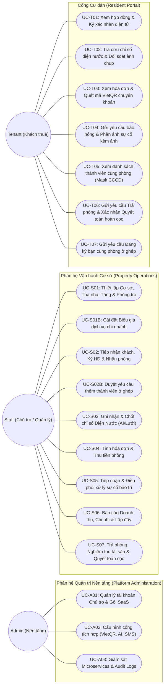
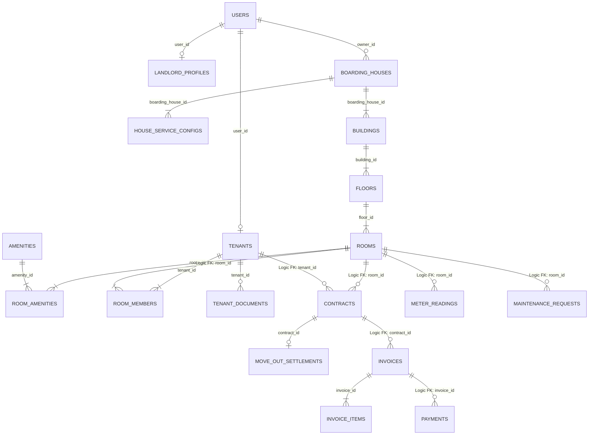

# TÀI LIỆU SƠ ĐỒ USE CASE & TỪ ĐIỂN THỰC THỂ CƠ SỞ DỮ LIỆU
## HỆ THỐNG QUẢN LÝ CHUỖI PHÒNG TRỌ ĐA CHI NHÁNH (MICROSERVICES SAAS)
**Mã tài liệu:** `DOC-USECASE-SCHEMA-2026`  
**Phiên bản:** `1.0.0`  
**Ngày lập:** `2026-10-03`  
**Mục đích:** Tổng hợp trực quan sơ đồ chức năng theo từng vai trò (Role-based Use Cases) và đặc tả chi tiết toàn bộ bảng thực thể cùng thuộc tính cho đội ngũ lập trình (Dev/DBA).

---

# PHẦN 1: SƠ ĐỒ USE CASE & DANH MỤC CHỨC NĂNG THEO TỪNG VAI TRÒ

## 1.1. Sơ đồ Use Case Tổng thể (Role-based Use Case Diagram)

---

## 1.2. Danh mục Chức năng chi tiết theo từng Vai trò

### 1. Vai trò ADMIN (Quản trị hệ thống SaaS)
| Mã UC | Tên chức năng | Mô tả nghiệp vụ | Vi dịch vụ phụ trách |
| :--- | :--- | :--- | :--- |
| **`UC-A01`** | **Quản lý Chủ trọ & Gói SaaS** | Khởi tạo và xét duyệt hồ sơ định danh pháp lý (KYC) của Chủ trọ (`ROLE_STAFF`) với đầy đủ thông tin CCCD (12 số, ngày cấp, nơi cấp, ảnh chụp CCCD 2 mặt, mã số thuế, địa chỉ thường trú); thiết lập hạn mức số cơ sở/tòa nhà tối đa; quản trị tài khoản toàn hệ thống (`auth_db.users`), khóa/mở khóa khi có vi phạm an ninh. | `auth-service` |
| **`UC-A02`** | **Cấu hình tích hợp dùng chung** | Cấu hình API Key OpenAI/Claude Vision OCR, thông số VietQR Gateway, SMTP Email server, SMS Brandname. | `api-gateway` / `payment-service` |
| **`UC-A03`** | **Giám sát hạ tầng & Audit Log** | Giám sát trạng thái hoạt động của các vi dịch vụ (Eureka Registry), hàng đợi RabbitMQ và tra cứu nhật ký an ninh hệ thống. | `discovery-server` |

---

### 2. Vai trò STAFF (Chủ trọ & Quản lý vận hành chi nhánh)
| Mã UC | Tên chức năng | Mô tả nghiệp vụ | Vi dịch vụ phụ trách |
| :--- | :--- | :--- | :--- |
| **`UC-S01`** | **Quản lý Cơ sở, Tòa nhà & Phòng** | Khai báo nhà trọ, tòa nhà, tầng; tạo hàng loạt phòng trọ kèm diện tích, đơn giá, tiện ích (AVAILABLE, OCCUPIED). | `room-service` |
| **`UC-S01B`**| **Cấu hình biểu giá dịch vụ** | Thiết lập đơn giá điện (VND/kWh), giá nước (theo m³, theo đầu người hoặc khoán phòng), phí rác, wifi cho từng cơ sở. | `room-service` |
| **`UC-S02`** | **Lập hợp đồng, Nhận phòng & Cấp quyền** | Khai báo thông tin khách đại diện (CCCD, SĐT), tự động cấp tài khoản Resident Portal; hỗ trợ khách gửi lại mã kích hoạt / đặt lại mật khẩu tạm qua SMS/Email khi khách gặp khó khăn đăng nhập. | `contract-service` & `tenant-service` |
| **`UC-S02B`**| **Duyệt thêm người ở ghép** | Kiểm tra số người tối đa phòng (`max_occupants`), duyệt yêu cầu thêm bạn cùng phòng từ khách; hệ thống tự động tạo tài khoản cho người mới và cập nhật cư trú. | `tenant-service` & `auth-service` |
| **`UC-S03`** | **Chốt chỉ số Điện & Nước** | Ghi nhận số điện nước cuối tháng bằng bảng nhập nhanh hoặc quét camera AI nhận diện mặt đồng hồ; tự động tính sản lượng. | `meter-service` & `ai-service` |
| **`UC-S04`** | **Tính hóa đơn & Quản lý thu tiền**| Tự động tổng hợp tiền phòng, điện, nước, dịch vụ phát sinh thành hóa đơn hàng tháng; phát hành thông báo kèm mã VietQR; xác nhận thu tiền mặt. | `billing-service` & `payment-service` |
| **`UC-S05`** | **Điều phối bảo trì sửa chữa** | Tiếp nhận phiếu báo hỏng từ khách, phân công thợ kỹ thuật, cập nhật tiến độ xử lý và lưu chi phí sửa chữa. | `maintenance-service` |
| **`UC-S06`** | **Báo cáo tài chính & Tỷ lệ lấp đầy**| Thống kê doanh thu thực thu, danh sách nợ đọng quá hạn, tỷ lệ lấp đầy phòng (%) và lợi nhuận ròng của các cơ sở mình sở hữu. | `report-service` |
| **`UC-S07`** | **Trả phòng & Quyết toán hoàn cọc**| Chốt số điện nước ngày rời đi, kiểm kê bồi thường thiết bị hư hỏng, quyết toán trừ công nợ lẻ, thanh toán hoàn cọc và chuyển trạng thái phòng. Tự động thu hồi quyền liên kết của tài khoản khách với phòng trọ và tiện ích tòa nhà. | `contract-service` & `room-service` |

---

### 3. Vai trò TENANT (Khách thuê trọ - Cổng Cư dân)
| Mã UC | Tên chức năng | Mô tả nghiệp vụ | Vi dịch vụ phụ trách |
| :--- | :--- | :--- | :--- |
| **`UC-T01`** | **Xem hợp đồng & Ký điện tử** | Xem chi tiết điều khoản hợp đồng thuê phòng, giá thuê, tiền cọc, nội quy nhà trọ và thực hiện ký xác nhận e-sign. | `contract-service` |
| **`UC-T02`** | **Tra cứu điện nước & Đối soát** | Theo dõi sản lượng điện nước 6 tháng gần nhất, xem ảnh chụp đồng hồ thực tế do quản lý tải lên; gửi phản ánh nếu phát hiện sai lệch. | `meter-service` |
| **`UC-T03`** | **Xem hóa đơn & Quét VietQR** | Xem bảng kê chi tiết tiền nhà hàng tháng, quét mã VietQR động để chuyển khoản tự động gạch nợ trong vòng 5-10 giây. | `billing-service` & `payment-service` |
| **`UC-T04`** | **Gửi yêu cầu Báo hỏng thiết bị** | Báo sự cố điện, nước, điều hòa kèm 1 - 3 ảnh hiện trường chụp từ camera, chọn mức độ khẩn cấp và theo dõi tiến độ sửa chữa. | `maintenance-service` |
| **`UC-T05`** | **Xem danh sách bạn cùng phòng** | Tra cứu danh sách thành viên đang ở cùng phòng, số điện thoại liên hệ, tình trạng tạm trú (Số CCCD được che mờ bảo vệ riêng tư). | `tenant-service` |
| **`UC-T06`** | **Gửi thông báo Trả phòng & Đối soát hoàn cọc** | Gửi thông báo chuyển đi trước N ngày (chọn ngày rời đi, lý do, cung cấp STK nhận cọc); xem biên bản nghiệm thu điện nước ngày lẻ và đối soát số tiền cọc hoàn trả. | `contract-service` |
| **`UC-T07`** | **Đăng ký bạn cùng phòng ở ghép** | Khách đã có tài khoản gửi yêu cầu thêm người bạn mới vào phòng (nhập họ tên, CCCD, SĐT, ảnh CCCD) gửi Chủ trọ phê duyệt để được cấp tài khoản app và thêm vào phòng. | `tenant-service` |

---

## 1.3. Nguyên tắc Phân định Trách nhiệm (SoD), Vòng đời Tài khoản & Cô lập Dữ liệu Chuỗi

Theo quan điểm thiết kế kiến trúc hệ thống và nghiệp vụ phần mềm SaaS (Quản lý chuỗi phòng trọ), hệ thống tuân thủ nghiêm ngặt 5 nguyên tắc nghiệp vụ cốt lõi sau:

---

### 1. Phân biệt rõ: "Tài khoản hệ thống" (Account) vs "Hồ sơ thuê trọ" (Tenant Profile)

| Tiêu chí | Quản lý Tài khoản (Account — `auth_db.users`) | Quản lý Hồ sơ Khách thuê (Tenant Profile — `tenant_db.tenants`) |
| :--- | :--- | :--- |
| **Bản chất** | Định danh đăng nhập, thông tin xác thực bảo mật (Security & Identity). | Quan hệ dân sự, hợp đồng thuê nhà, cư trú pháp lý (Business & Legal). |
| **Dữ liệu gồm** | `username`, `phone/email`, `password_hash`, `role`, `status` (`ACTIVE`/`LOCKED`). | CCCD/Hộ chiếu, ngày sinh, quê quán, số phòng đang ở, tiền cọc, hợp đồng, thành viên cùng phòng. |
| **Ai toàn quyền xử lý?** | **ADMIN** (kỹ thuật hệ thống) & bản thân User (tự đổi mật khẩu). | **CHỦ TRỌ / STAFF** (người trực tiếp kinh doanh và ký hợp đồng). |

---

### 2. Quyền hạn & Ranh giới của ADMIN đối với Khách thuê (Mức Kỹ thuật / Platform)

* **Quyền kỹ thuật được phép:**
  - Quản lý danh mục tài khoản toàn hệ thống (`auth_db.users`), xem trạng thái hoạt động (`ACTIVE`, `LOCKED`).
  - **Khóa / Mở khóa tài khoản (`LOCKED` / `ACTIVE`):** Thực hiện khi phát hiện tài khoản có hành vi tấn công, spam request, brute-force mật khẩu, hoặc khi tiếp nhận Ticket báo cáo vi phạm gian lận nghiêm trọng từ Chủ trọ.
  - **Kích hoạt quy trình đặt lại mật khẩu (Force Reset Password):** Hỗ trợ gửi link/OTP reset mật khẩu về SMS/Email khi khách bị mất quyền truy cập (Admin tuyệt đối không được xem hay tự đặt mật khẩu thô của khách).
  - **Xem nhật ký bảo mật (Audit Log):** Tra cứu lịch sử đăng nhập, IP truy cập bất thường của tài khoản để phát hiện truy cập trái phép.
* **Ranh giới nghiêm cấm (Mức Nghiệp vụ / Dân sự):**
  - **Không can thiệp hồ sơ thuê trọ:** Admin không được sửa đổi thông tin cá nhân/CCCD của khách (`tenant_db.tenants`), không gán phòng hay thay đổi hợp đồng thuê.
  - **Không làm trọng tài phân xử tranh chấp dân sự:** Quan hệ thuê phòng là hợp đồng trực tiếp giữa Chủ trọ và Khách thuê. Admin không can thiệp, không phán xét ai đúng ai sai. Hệ thống giải quyết bằng **bằng chứng dữ liệu số khách quan** (ảnh chụp công tơ điện nước, lịch sử chuyển khoản VietQR, biên bản bàn giao phòng kèm ảnh hiện trạng có gắn timestamp).

---

### 3. Quyền hạn & Ranh giới của CHỦ TRỌ (STAFF) đối với Khách thuê

* **Quyền được thực hiện:**
  - **Cấp tài khoản ban đầu (Provisioning):** Khi lập hợp đồng (`UC-S02`) hoặc duyệt bạn ở ghép (`UC-S02B`), hệ thống tự động sinh tài khoản `ROLE_TENANT` và gửi mật khẩu tạm cho khách qua SMS/Email.
  - **Cấp / Thu hồi quyền truy cập (Grant / Revoke Access):** Cấp quyền truy cập Resident Portal của khu trọ khi ký hợp đồng; tự động thu hồi quyền liên kết khi nghiệm thu trả phòng (`UC-S07`).
  - **Hỗ trợ khách đăng nhập:** Cung cấp nút bấm *"Gửi lại mật khẩu tạm / OTP"* về đúng SĐT của khách khi khách quên mật khẩu hoặc không rành công nghệ.
  - **Gửi Ticket báo cáo vi phạm:** Báo cáo lên Admin kèm chứng cứ khi khách có hành vi trộm cắp, phá hoại, quỵt nợ bỏ trốn để Admin khóa tài khoản toàn sàn.
* **Quyền bị nghiêm cấm:**
  - **Không được xem hoặc tự ý đổi mật khẩu của khách:** Đảm bảo nguyên tắc chống chối bỏ (Non-repudiation) khi khách ký hợp đồng hoặc xác nhận hóa đơn.
  - **Không được xóa vĩnh viễn tài khoản của khách:** Tài khoản là định danh số cá nhân của khách. Chủ trọ chỉ có quyền hủy liên kết với phòng trọ của mình.

---

### 4. Quy tắc Vòng đời Tài khoản khi Trả phòng & Điều kiện Khóa tài khoản

* **Khi khách trả phòng (`UC-S07: Nghiệm thu Trả phòng & Quyết toán cọc`):**
  - Hệ thống **tự động cắt đứt quyền liên kết** của khách với phòng trọ và cơ sở cũ (gỡ khỏi `room_members`, đóng hợp đồng). Khách không còn mở được khóa cổng, không xem camera hay gửi sự cố cho nhà trọ cũ.
  - **Tài khoản TUYỆT ĐỐI KHÔNG BỊ KHÓA, KHÔNG BỊ XÓA (`status = ACTIVE`):** Khách vẫn đăng nhập bình thường để xem lại lịch sử hóa đơn, hợp đồng cũ đã thanh lý, và sẵn sàng tái sử dụng tài khoản này khi thuê phòng mới (chỉ cần đọc SĐT cho chủ trọ mới gán phòng, không cần tạo tài khoản lại từ đầu).
* **Tài khoản khách thuê CHỈ BỊ KHÓA (`LOCKED`) trong các trường hợp:**
  1. *Khóa tự động:* Nhập sai mật khẩu liên tiếp quá 5 lần (chống dò mật khẩu Brute-force) hoặc phát hiện spam mã độc tấn công API.
  2. *Admin khóa thủ công:* Khi tiếp nhận báo cáo vi phạm nghiêm trọng (lừa đảo, phá hoại tài sản, quỵt nợ bỏ trốn) hoặc có yêu cầu điều tra từ cơ quan chức năng.
  3. *Không khóa khi:* Khách vừa trả phòng, chưa tìm được phòng mới, hoặc nợ tiền phòng trễ hạn (chỉ gửi thông báo nhắc nợ để khách mở app quét VietQR thanh toán).

---

### 5. Ràng buộc "1 Khách - 1 Phòng" & Cơ chế Cô lập Dữ liệu Chuỗi Trọ (Strict Multi-tenant Isolation)

* **Ràng buộc thuê phòng (Single Active Lease Constraint):**
  - Trong phạm vi V1.0 của đồ án, mỗi khách thuê tại một thời điểm chỉ kích hoạt **1 hợp đồng phòng có hiệu lực (`ACTIVE`)**.
  - Muốn thuê phòng mới, khách phải hoàn tất thủ tục trả phòng cũ hoặc làm quy trình chuyển phòng.
  - *(Lưu ý thiết kế:* Tại tầng Cơ sở dữ liệu, cột `tenant_id` trong bảng `contracts` vẫn là khóa ngoại 1 - Nhiều bình thường để hệ thống sẵn sàng mở rộng sau này, không đặt ràng buộc `UNIQUE` cứng*).*
* **Cơ chế Cô lập Dữ liệu Chuỗi Trọ (Strict Multi-tenant Isolation):**
  - **Phạm vi hiển thị của Khách thuê:** Khách thuê của **Chủ trọ A** khi đăng nhập vào hệ thống **CHỈ XEM ĐƯỢC** chuỗi cơ sở, tòa nhà, phòng mình đang thuê và các phòng trống thuộc sở hữu của **Chủ trọ A** (`WHERE owner_id = :current_landlord_id`).
  - **Cách ly tuyệt đối với Chủ trọ khác:** Khách thuê của Chủ trọ A **TUYỆT ĐỐI KHÔNG XEM ĐƯỢC** bất kỳ thông tin nào (danh sách cơ sở, tòa nhà, phòng trọ, giá thuê, cư dân, doanh thu) của **Chủ trọ B**.
  - **Mô hình SaaS khép kín:** Hệ thống không mở sàn tìm phòng công khai giữa các chủ trọ, đảm bảo an toàn bí mật kinh doanh và tối ưu hóa hiệu năng, giảm thiểu tối đa khối lượng code giao diện cho đồ án.

---

# PHẦN 2: CÁC BẢNG THỰC THỂ & TỪ ĐIỂN DỮ LIỆU CHI TIẾT (DATABASE-PER-SERVICE)

Mô hình dữ liệu tuân thủ chuẩn **Database per Service** cho 10 vi dịch vụ. Các khóa ngoại giữa các database khác nhau được quản lý bằng **Khóa ngoại Logic (Logical FK)** và đồng bộ sự kiện qua RabbitMQ.

---

## 2.1. Phân hệ Xác thực & Tài khoản (`auth_db` — `auth-service`)

### 1. Bảng `users` (Tài khoản người dùng)
| Tên cột | Kiểu dữ liệu | Ràng buộc | Giải thích nghiệp vụ |
| :--- | :--- | :--- | :--- |
| `id` | BIGINT | PK, AUTO_INCREMENT | Khóa chính duy nhất của người dùng |
| `username` | VARCHAR(50) | UNIQUE, NOT NULL | Tên đăng nhập hệ thống |
| `password` | VARCHAR(255) | NOT NULL | Mật khẩu đã mã hóa BCrypt |
| `full_name` | VARCHAR(100) | NOT NULL | Họ và tên hiển thị |
| `email` | VARCHAR(100) | UNIQUE, NULLABLE | Email nhận thông báo / hóa đơn |
| `phone` | VARCHAR(20) | UNIQUE, NOT NULL | Số điện thoại đăng nhập chính chủ |
| `role` | VARCHAR(20) | NOT NULL | `ROLE_ADMIN`, `ROLE_STAFF`, `ROLE_TENANT` |
| `status` | VARCHAR(20) | DEFAULT 'ACTIVE' | Trạng thái tài khoản: `ACTIVE`, `LOCKED` |
| `created_at` | DATETIME | NOT NULL | Thời điểm tạo tài khoản |
| `updated_at` | DATETIME | NOT NULL | Thời điểm cập nhật cuối cùng |

### 1B. Bảng `landlord_profiles` (Hồ sơ pháp lý & Định danh CCCD của Chủ trọ — KYC do Admin quản lý)
| Tên cột | Kiểu dữ liệu | Ràng buộc | Giải thích nghiệp vụ |
| :--- | :--- | :--- | :--- |
| `id` | BIGINT | PK, AUTO_INCREMENT | Khóa chính hồ sơ định danh chủ trọ |
| `user_id` | BIGINT | **UNIQUE, NOT NULL, FK -> `users.id`** | **Tài khoản Chủ trọ sở hữu hồ sơ (`ROLE_STAFF`)** |
| `identity_card` | VARCHAR(20) | **UNIQUE, NOT NULL** | **Số Căn cước công dân chính chủ (12 chữ số)** |
| `full_name` | VARCHAR(100) | NOT NULL | Họ và tên đầy đủ theo CCCD |
| `birth_date` | DATE | NOT NULL | Ngày tháng năm sinh |
| `issue_date` | DATE | NOT NULL | Ngày cấp CCCD |
| `issue_place` | VARCHAR(150) | NOT NULL | Nơi cấp (Cục Cảnh sát QLHC về TTXH) |
| `permanent_address` | VARCHAR(255) | NOT NULL | Địa chỉ thường trú ghi trên CCCD |
| `cccd_front_url` | VARCHAR(500) | NOT NULL | Link ảnh chụp mặt trước thẻ CCCD |
| `cccd_back_url` | VARCHAR(500) | NOT NULL | Link ảnh chụp mặt sau thẻ CCCD |
| `tax_code` | VARCHAR(30) | NULLABLE | Mã số thuế cá nhân hoặc hộ kinh doanh cá thể |
| `business_license_url`| VARCHAR(500)| NULLABLE | Link ảnh giấy phép kinh doanh / an toàn PCCC (nếu có) |
| `kyc_status` | VARCHAR(20) | DEFAULT 'PENDING' | Trạng thái định danh: `PENDING` (Chờ duyệt), `VERIFIED` (Đã duyệt), `REJECTED` (Từ chối) |
| `rejection_reason` | VARCHAR(255) | NULLABLE | Lý do Admin từ chối phê duyệt hồ sơ |
| `verified_at` | DATETIME | NULLABLE | Thời điểm Admin xét duyệt hồ sơ |
| `verified_by` | BIGINT | NULLABLE | Mã Admin thực hiện phê duyệt (`auth_db.users.id`) |
| `created_at` | DATETIME | NOT NULL | Thời điểm đăng ký hồ sơ |
| `updated_at` | DATETIME | NOT NULL | Thời điểm cập nhật cuối cùng |

---

## 2.2. Phân hệ Cơ sở & Phòng trọ (`room_db` — `room-service`)

### 2. Bảng `boarding_houses` (Cơ sở nhà trọ / Chi nhánh)
| Tên cột | Kiểu dữ liệu | Ràng buộc | Giải thích nghiệp vụ |
| :--- | :--- | :--- | :--- |
| `id` | BIGINT | PK, AUTO_INCREMENT | Mã định danh duy nhất của cơ sở |
| `owner_id` | BIGINT | NOT NULL, INDEX | **Mã chủ sở hữu (Logic FK -> `auth_db.users.id`)** |
| `code` | VARCHAR(20) | UNIQUE, NOT NULL | Mã viết tắt cơ sở (VD: `CS-CG01`, `CS-BK02`) |
| `name` | VARCHAR(150) | NOT NULL | Tên cơ sở nhà trọ |
| `address` | VARCHAR(255) | NOT NULL | Số nhà, tên ngõ, tên đường chi tiết |
| `ward` | VARCHAR(100) | NULLABLE | Phường / Xã |
| `district` | VARCHAR(100) | NULLABLE | Quận / Huyện |
| `city` | VARCHAR(100) | NULLABLE | Tỉnh / Thành phố |
| `manager_name` | VARCHAR(100) | NULLABLE | Tên người quản lý trực tiếp cơ sở |
| `manager_phone`| VARCHAR(20) | NOT NULL | Số hotline hỗ trợ của cơ sở |
| `status` | VARCHAR(20) | DEFAULT 'ACTIVE' | Trạng thái: `ACTIVE`, `INACTIVE` |
| `created_at` | DATETIME | NOT NULL | Ngày thêm cơ sở vào hệ thống |

### 3. Bảng `house_service_configs` (Biểu giá dịch vụ cơ sở)
| Tên cột | Kiểu dữ liệu | Ràng buộc | Giải thích nghiệp vụ |
| :--- | :--- | :--- | :--- |
| `id` | BIGINT | PK, AUTO_INCREMENT | Khóa chính bản ghi cấu hình |
| `boarding_house_id` | BIGINT | FK -> `boarding_houses.id` | Liên kết cơ sở sở hữu biểu giá |
| `service_name` | VARCHAR(100) | NOT NULL | Tên dịch vụ: Tiền điện, Tiền nước, Phí rác, Wifi, Gửi xe |
| `calculation_type` | VARCHAR(30) | NOT NULL | Cách tính: `METER` (đồng hồ), `PER_CAPITA` (đầu người), `PER_ROOM` (cố định/phòng) |
| `unit_price` | DECIMAL(15,2)| NOT NULL | Đơn giá tiền VND |

### 4. Bảng `buildings` (Tòa nhà)
| Tên cột | Kiểu dữ liệu | Ràng buộc | Giải thích nghiệp vụ |
| :--- | :--- | :--- | :--- |
| `id` | BIGINT | PK, AUTO_INCREMENT | Khóa chính tòa nhà |
| `boarding_house_id` | BIGINT | FK -> `boarding_houses.id` | Thuộc về cơ sở nào |
| `name` | VARCHAR(100) | NOT NULL | Tên tòa nhà: Tòa A, Tòa B, Tòa C |
| `created_at` | DATETIME | NOT NULL | Thời điểm tạo |

### 5. Bảng `floors` (Tầng)
| Tên cột | Kiểu dữ liệu | Ràng buộc | Giải thích nghiệp vụ |
| :--- | :--- | :--- | :--- |
| `id` | BIGINT | PK, AUTO_INCREMENT | Khóa chính tầng |
| `building_id` | BIGINT | FK -> `buildings.id` | Thuộc về tòa nhà nào |
| `floor_number` | INT | NOT NULL | Thứ tự tầng: 1, 2, 3, 4, 5... |

### 6. Bảng `rooms` (Phòng trọ)
| Tên cột | Kiểu dữ liệu | Ràng buộc | Giải thích nghiệp vụ |
| :--- | :--- | :--- | :--- |
| `id` | BIGINT | PK, AUTO_INCREMENT | Mã định danh phòng |
| `floor_id` | BIGINT | FK -> `floors.id` | Phòng nằm ở tầng nào |
| `room_number` | VARCHAR(20) | NOT NULL | Tên số phòng: `P.101`, `P.201`... |
| `base_price` | DECIMAL(15,2)| NOT NULL | Giá thuê niêm yết cơ bản hàng tháng |
| `area` | DOUBLE | NOT NULL | Diện tích phòng ($m^2$) |
| `max_occupants` | INT | DEFAULT 2 | Số lượng người ở tối đa cho phép |
| `status` | VARCHAR(20) | DEFAULT 'AVAILABLE'| Trạng thái: `AVAILABLE` (Trống), `OCCUPIED` (Đang ở), `MAINTENANCE` (Hỏng), `CLEANING` (Chờ dọn) |
| `created_at` | DATETIME | NOT NULL | Ngày tạo phòng |

### 7. Bảng `amenities` & `room_amenities` (Tiện ích phòng)
* `amenities`: `id` (PK), `name` (Điều hòa, Nóng lạnh, Tủ lạnh...), `icon` (Tên icon hiển thị).
* `room_amenities`: `room_id` (PK, FK -> `rooms.id`), `amenity_id` (PK, FK -> `amenities.id`).

---

## 2.3. Phân hệ Khách thuê (`tenant_db` — `tenant-service`)

### 8. Bảng `tenants` (Hồ sơ pháp lý khách thuê)
| Tên cột | Kiểu dữ liệu | Ràng buộc | Giải thích nghiệp vụ |
| :--- | :--- | :--- | :--- |
| `id` | BIGINT | PK, AUTO_INCREMENT | Mã định danh hồ sơ khách |
| `user_id` | BIGINT | **UNIQUE, NOT NULL** | **Liên kết tài khoản đăng nhập (`auth_db.users.id`)** |
| `full_name` | VARCHAR(100) | NOT NULL | Họ và tên đầy đủ theo CCCD |
| `identity_card` | VARCHAR(20) | UNIQUE, NOT NULL | Số CCCD/Định danh cá nhân (12 chữ số) |
| `birth_date` | DATE | NOT NULL | Ngày tháng năm sinh |
| `gender` | VARCHAR(10) | NOT NULL | Giới tính: `MALE`, `FEMALE`, `OTHER` |
| `phone` | VARCHAR(20) | UNIQUE, NOT NULL | Số điện thoại chính chủ |
| `email` | VARCHAR(100) | NULLABLE | Email nhận thông báo hóa đơn |
| `hometown` | VARCHAR(255) | NULLABLE | Quê quán |
| `address` | VARCHAR(255) | NULLABLE | Địa chỉ thường trú theo CCCD |
| `status` | VARCHAR(20) | DEFAULT 'ACTIVE' | Trạng thái: `ACTIVE`, `INACTIVE`, `BLACKLIST` |

### 9. Bảng `room_members` (Thành viên cư trú cùng phòng trọ)
| Tên cột | Kiểu dữ liệu | Ràng buộc | Giải thích nghiệp vụ |
| :--- | :--- | :--- | :--- |
| `id` | BIGINT | PK, AUTO_INCREMENT | Mã định danh bản ghi cư trú |
| `room_id` | BIGINT | NOT NULL, INDEX | **Mã phòng đang ở (Logic FK -> `room_db.rooms.id`)** |
| `tenant_id` | BIGINT | FK -> `tenants.id` | Liên kết hồ sơ thành viên |
| `contract_id` | BIGINT | NOT NULL, INDEX | **Hợp đồng bảo trợ (Logic FK -> `contract_db.contracts.id`)** |
| `role_in_room` | VARCHAR(20) | NOT NULL | `REPRESENTATIVE` (Đại diện HĐ), `MEMBER` (Ở ghép) |
| `join_date` | DATE | NOT NULL | Ngày bắt đầu chuyển vào ở |
| `temp_residence_status`| VARCHAR(20)| DEFAULT 'NOT_REGISTERED'| Tình trạng khai báo tạm trú: `REGISTERED`, `NOT_REGISTERED` |
| `status` | VARCHAR(20) | DEFAULT 'ACTIVE' | `ACTIVE` (Đang ở), `MOVED_OUT` (Đã chuyển đi) |

### 10. Bảng `roommate_requests` (Yêu cầu đăng ký bạn cùng phòng ở ghép)
| Tên cột | Kiểu dữ liệu | Ràng buộc | Giải thích nghiệp vụ |
| :--- | :--- | :--- | :--- |
| `id` | BIGINT | PK, AUTO_INCREMENT | Mã định danh yêu cầu thêm người |
| `room_id` | BIGINT | NOT NULL, INDEX | Phòng muốn thêm người ở ghép |
| `requested_by_tenant_id` | BIGINT | FK -> `tenants.id` | Khách thuê đang ở gửi yêu cầu |
| `full_name` | VARCHAR(100) | NOT NULL | Họ và tên người bạn mới |
| `identity_card` | VARCHAR(20) | NOT NULL | Số CCCD 12 số của người bạn mới |
| `phone` | VARCHAR(20) | NOT NULL | Số điện thoại người bạn mới |
| `birth_date` | DATE | NOT NULL | Ngày sinh |
| `gender` | VARCHAR(10) | NOT NULL | Giới tính: `MALE`, `FEMALE`, `OTHER` |
| `hometown` | VARCHAR(255) | NULLABLE | Quê quán |
| `cccd_front_url` | VARCHAR(255) | NULLABLE | Ảnh mặt trước CCCD để khai báo tạm trú |
| `cccd_back_url` | VARCHAR(255) | NULLABLE | Ảnh mặt sau CCCD |
| `status` | VARCHAR(20) | DEFAULT 'PENDING'| Trạng thái: `PENDING` (Chờ duyệt), `APPROVED` (Đã duyệt), `REJECTED` (Từ chối) |
| `rejection_reason` | VARCHAR(255)| NULLABLE | Lý do từ chối (VD: Phòng đã vượt quá 2 người) |
| `created_at` | DATETIME | NOT NULL | Thời điểm gửi yêu cầu |
| `reviewed_at` | DATETIME | NULLABLE | Thời điểm Chủ trọ phê duyệt/từ chối |

---

## 2.4. Phân hệ Hợp đồng (`contract_db` — `contract-service`)

### 10. Bảng `contracts` (Hợp đồng thuê phòng)
| Tên cột | Kiểu dữ liệu | Ràng buộc | Giải thích nghiệp vụ |
| :--- | :--- | :--- | :--- |
| `id` | BIGINT | PK, AUTO_INCREMENT | Khóa chính hợp đồng |
| `contract_code` | VARCHAR(50) | UNIQUE, NOT NULL | Mã hiển thị hợp đồng (VD: `HD-202609-001`) |
| `tenant_id` | BIGINT | NOT NULL, INDEX | **Đại diện ký hợp đồng (Logic FK -> `tenant_db.tenants.id`)** |
| `room_id` | BIGINT | NOT NULL, INDEX | **Phòng được thuê (Logic FK -> `room_db.rooms.id`)** |
| `start_date` | DATE | NOT NULL | Ngày bắt đầu tính tiền thuê |
| `end_date` | DATE | NOT NULL | Ngày kết thúc hạn hợp đồng |
| `rental_price` | DECIMAL(15,2)| NOT NULL | Giá thuê thỏa thuận cố định hàng tháng |
| `deposit_amount`| DECIMAL(15,2)| NOT NULL | Tiền đặt cọc giữ phòng |
| `payment_cycle`| INT | DEFAULT 1 | Chu kỳ trả tiền (1 tháng/lần) |
| `status` | VARCHAR(20) | DEFAULT 'ACTIVE' | `PENDING_SIGN`, `ACTIVE`, `EXPIRED`, `TERMINATED` |

### 11. Bảng `move_out_settlements` (Quyết toán thanh lý trả phòng)
| Tên cột | Kiểu dữ liệu | Ràng buộc | Giải thích nghiệp vụ |
| :--- | :--- | :--- | :--- |
| `id` | BIGINT | PK, AUTO_INCREMENT | Mã quyết toán thanh lý |
| `contract_id` | BIGINT | FK -> `contracts.id` | Hợp đồng được thanh lý |
| `room_id` | BIGINT | NOT NULL, INDEX | Phòng trả lại |
| `move_out_date` | DATE | NOT NULL | Ngày trả phòng thực tế |
| `final_meter_reading_id` | BIGINT | NULLABLE | Mã chốt chỉ số điện nước ngày dọn đi |
| `damage_fee` | DECIMAL(15,2)| DEFAULT 0 | Tiền bồi thường thiết bị hư hại |
| `unpaid_utilities_fee` | DECIMAL(15,2)| DEFAULT 0 | Tiền điện nước phát sinh ngày lẻ |
| `original_deposit` | DECIMAL(15,2)| NOT NULL | Số tiền cọc ban đầu trên hợp đồng |
| `refund_amount` | DECIMAL(15,2)| NOT NULL | **Số tiền cọc thực trả lại cho khách** |
| `refund_status` | VARCHAR(20) | DEFAULT 'COMPLETED' | Trạng thái: `COMPLETED`, `PENDING` |
| `settled_at` | DATETIME | NOT NULL | Thời điểm hoàn tất quyết toán |

---

## 2.5. Phân hệ Điện Nước (`meter_db` — `meter-service`)

### 12. Bảng `meter_readings` (Ghi nhận chỉ số tiêu thụ)
| Tên cột | Kiểu dữ liệu | Ràng buộc | Giải thích nghiệp vụ |
| :--- | :--- | :--- | :--- |
| `id` | BIGINT | PK, AUTO_INCREMENT | Khóa chính bản ghi đo |
| `room_id` | BIGINT | NOT NULL, INDEX | **Mã phòng đo (Logic FK -> `room_db.rooms.id`)** |
| `reading_date` | DATE | NOT NULL | Ngày thực tế đi chốt số |
| `reading_type` | VARCHAR(20) | DEFAULT 'MONTHLY'| Loại chốt: `MONTHLY` (Định kỳ), `MOVE_IN`, `MOVE_OUT` (Trả phòng lẻ) |
| `recorded_month`| INT | NOT NULL | Kỳ tháng chốt (1 - 12) |
| `recorded_year` | INT | NOT NULL | Kỳ năm chốt (VD: 2026) |
| `old_electricity`| DOUBLE | NOT NULL | Chỉ số công tơ điện cũ |
| `new_electricity`| DOUBLE | NOT NULL | Chỉ số công tơ điện mới |
| `old_water` | DOUBLE | NOT NULL | Chỉ số đồng hồ nước cũ |
| `new_water` | DOUBLE | NOT NULL | Chỉ số đồng hồ nước mới |
| `image_evidence_url`| VARCHAR(255)| NULLABLE | Link ảnh chụp công tơ làm bằng chứng đối soát |
| `recorded_by` | VARCHAR(50) | NOT NULL | Người ghi nhận (Tên Staff / `AUTO_AI`) |

---

## 2.6. Phân hệ Hóa đơn & Thu tiền (`billing_db` & `payment_db`)

### 13. Bảng `invoices` (Hóa đơn thu tiền phòng)
| Tên cột | Kiểu dữ liệu | Ràng buộc | Giải thích nghiệp vụ |
| :--- | :--- | :--- | :--- |
| `id` | BIGINT | PK, AUTO_INCREMENT | Khóa chính hóa đơn |
| `invoice_code` | VARCHAR(50) | UNIQUE, NOT NULL | Mã hóa đơn hiển thị (VD: `HD-202609-01`) |
| `contract_id` | BIGINT | NOT NULL, INDEX | **Logic FK -> `contract_db.contracts.id`** |
| `room_id` | BIGINT | NOT NULL, INDEX | **Logic FK -> `room_db.rooms.id`** |
| `tenant_id` | BIGINT | NOT NULL, INDEX | **Người nhận hóa đơn (Logic FK -> `tenant_db.tenants.id`)** |
| `month` / `year` | INT / INT | NOT NULL | Kỳ hóa đơn |
| `room_fee` | DECIMAL(15,2)| NOT NULL | Tiền phòng tháng |
| `electricity_fee`| DECIMAL(15,2)| NOT NULL | Tiền điện tiêu thụ trong kỳ |
| `water_fee` | DECIMAL(15,2)| NOT NULL | Tiền nước tiêu thụ |
| `service_fee` | DECIMAL(15,2)| NOT NULL | Phí dịch vụ cố định (rác, wifi, gửi xe) |
| `discount` | DECIMAL(15,2)| DEFAULT 0 | Khấu trừ giảm giá |
| `total_amount` | DECIMAL(15,2)| NOT NULL | **Tổng số tiền phải thanh toán** |
| `status` | VARCHAR(20) | NOT NULL | Trạng thái: `UNPAID`, `PAID`, `OVERDUE`, `CANCELLED` |
| `due_date` | DATE | NOT NULL | Hạn chót thanh toán (thường ngày 05 hàng tháng) |
| `paid_at` | DATETIME | NULLABLE | Thời điểm thanh toán thành công |

### 14. Bảng `invoice_items` (Chi tiết từng khoản mục)
* `id` (PK), `invoice_id` (FK -> `invoices.id`), `item_name` (Tiền phòng, Tiền điện, Phí rác...), `quantity` (Số lượng), `unit_price` (Đơn giá), `amount` (Thành tiền).

### 15. Bảng `payments` (Lịch sử giao dịch thanh toán)
| Tên cột | Kiểu dữ liệu | Ràng buộc | Giải thích nghiệp vụ |
| :--- | :--- | :--- | :--- |
| `id` | BIGINT | PK, AUTO_INCREMENT | Khóa chính giao dịch |
| `invoice_id` | BIGINT | NOT NULL, INDEX | **Hóa đơn được gạch nợ (Logic FK -> `billing_db.invoices.id`)** |
| `payment_code` | VARCHAR(50) | UNIQUE, NOT NULL | Mã giao dịch nội bộ (VD: `PAY-202609-001`) |
| `amount` | DECIMAL(15,2)| NOT NULL | Số tiền thực trả |
| `payment_method`| VARCHAR(20) | NOT NULL | Phương thức: `VIETQR`, `CASH`, `BANK_TRANSFER` |
| `transaction_ref`| VARCHAR(100)| NULLABLE | Mã giao dịch ngân hàng trả về từ Webhook |
| `status` | VARCHAR(20) | NOT NULL | `SUCCESS`, `FAILED` |
| `payment_time` | DATETIME | NOT NULL | Thời điểm thanh toán |

---

## 2.7. Phân hệ Bảo trì & Báo cáo (`maintenance_db` & `report_db`)

### 16. Bảng `maintenance_requests` (Yêu cầu báo hỏng thiết bị)
| Tên cột | Kiểu dữ liệu | Ràng buộc | Giải thích nghiệp vụ |
| :--- | :--- | :--- | :--- |
| `id` | BIGINT | PK, AUTO_INCREMENT | Khóa chính sự cố |
| `room_id` | BIGINT | NOT NULL, INDEX | **Phòng xảy ra sự cố (Logic FK -> `room_db.rooms.id`)** |
| `tenant_id` | BIGINT | NOT NULL, INDEX | **Khách gửi phản ánh (Logic FK -> `tenant_db.tenants.id`)** |
| `title` | VARCHAR(200) | NOT NULL | Tiêu đề hỏng hóc (VD: Hỏng vòi sen nhà tắm) |
| `description` | TEXT | NULLABLE | Mô tả hiện tượng chi tiết |
| `image_url` | VARCHAR(255) | NULLABLE | Ảnh hiện trường do khách chụp đính kèm |
| `priority` | VARCHAR(20) | NOT NULL | Mức ưu tiên: `LOW`, `MEDIUM`, `HIGH`, `URGENT` |
| `status` | VARCHAR(20) | NOT NULL | `PENDING` (Chờ xử lý), `IN_PROGRESS` (Đang sửa), `RESOLVED` (Đã sửa) |
| `cost` | DECIMAL(15,2)| DEFAULT 0 | Chi phí sửa chữa phát sinh |
| `created_at` | DATETIME | NOT NULL | Thời điểm gửi yêu cầu |
| `resolved_at` | DATETIME | NULLABLE | Thời điểm sửa chữa hoàn tất |

### 17. Bảng `monthly_reports` (Tổng hợp tài chính chi nhánh)
| Tên cột | Kiểu dữ liệu | Ràng buộc | Giải thích nghiệp vụ |
| :--- | :--- | :--- | :--- |
| `id` | BIGINT | PK, AUTO_INCREMENT | Khóa chính bản ghi báo cáo |
| `boarding_house_id` | BIGINT | NOT NULL, INDEX | **Cơ sở trọ được thống kê (Logic FK -> `room_db.boarding_houses.id`)** |
| `month` / `year` | INT / INT | NOT NULL | Kỳ tháng / năm tổng kết |
| `total_revenue` | DECIMAL(15,2)| NOT NULL | Tổng số tiền thực thu |
| `total_expense` | DECIMAL(15,2)| NOT NULL | Tổng chi phí vận hành, bảo trì |
| `net_profit` | DECIMAL(15,2)| NOT NULL | Lợi nhuận ròng: `Doanh thu - Chi phí` |
| `occupancy_rate`| DOUBLE | NOT NULL | Tỷ lệ lấp đầy phòng (%) |
| `generated_at` | DATETIME | NOT NULL | Thời điểm sinh báo cáo |
